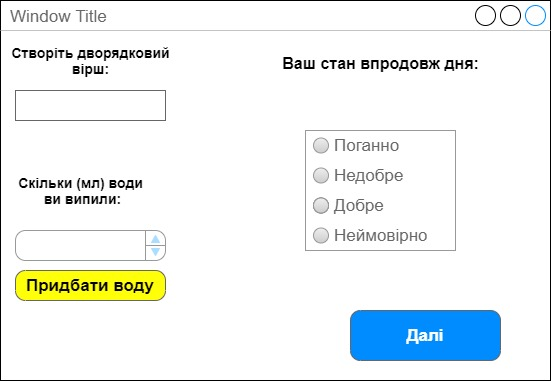
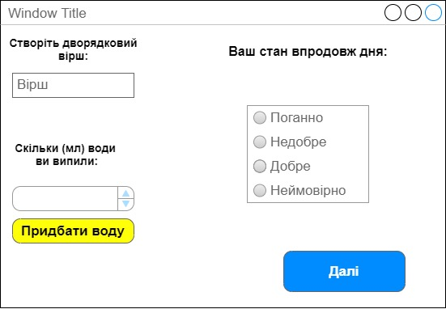
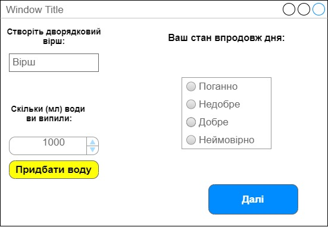
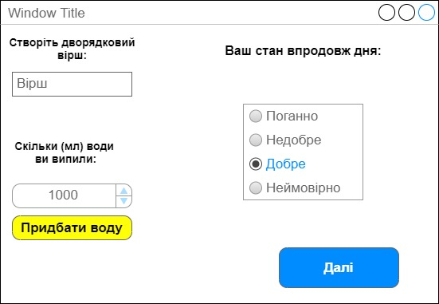
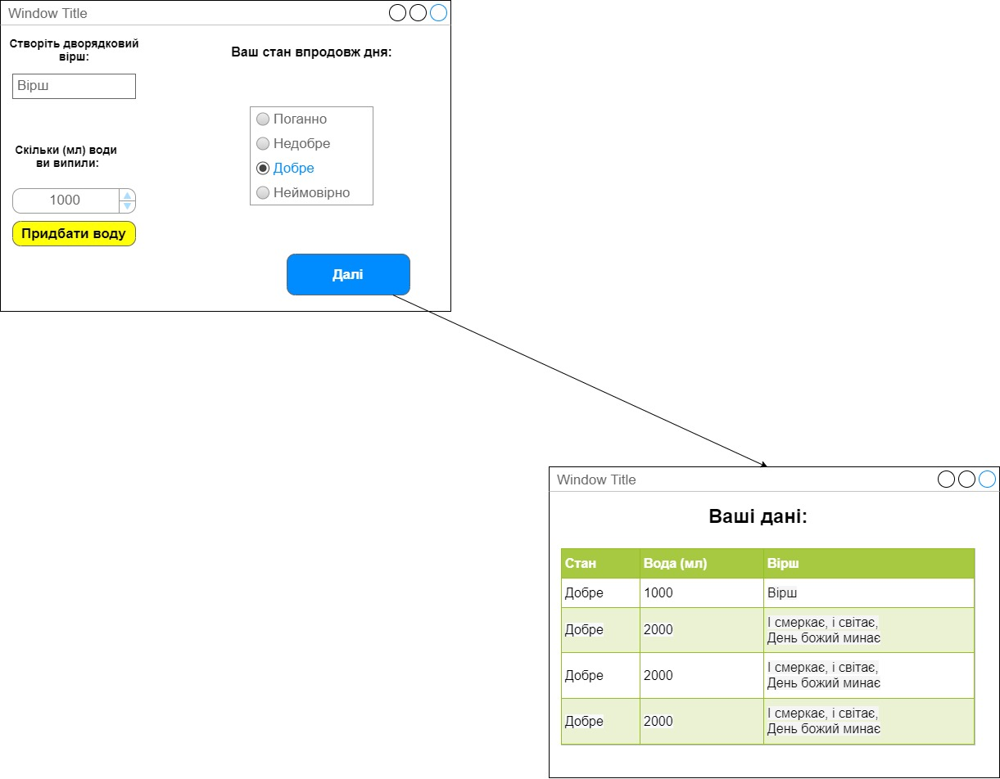

| NFR id | TC id | Опис кроків тестового сценарію                                                                                | Опис очікуваних результатів                |
|--------|-------|---------------------------------------------------------------------------------------------------------------|--------------------------------------------|
| NFR3 | TC1.6 | Початкові умови: відсутні Кроки сценарію: відсутні                                                         | Екрана форма:  |
| NFR3 | TC1.7 | Початкові умови: успішно пройдено ТС1.6  Кроки сценарію: 1) В текстове поле внести значення "Вірш"   | Екрана форма:  |
| NFR3 | TC1.8 | Початкові умови: успішно пройдено ТС1.7  Кроки сценарію: 1) В цифрове поле внести значення об'єму води| Екрана форма:  |
| NFR3 | TC1.9 | Початкові умови: успішно пройдено ТС1.8  Кроки сценарію: 1) Натиснути на варіант стану        | Екрана форма:  |
| NFR3 | TC1.10 | Початкові умови: успішно пройдено ТС1.9  Кроки сценарію: 1) Натиснути на кнопку Далі        | Екрана форма:  |
